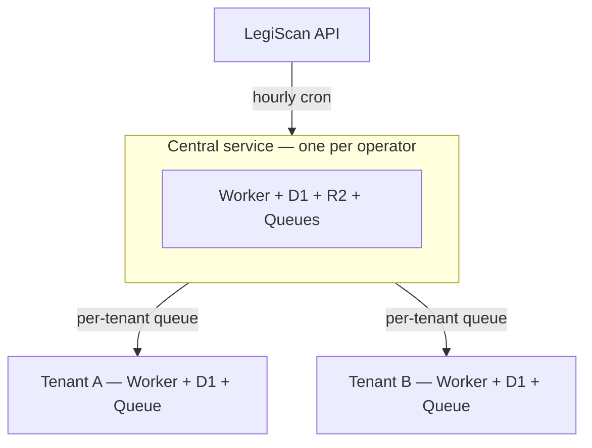

  <a href="https://floorvote.org">
    <picture>
      <source media="(prefers-color-scheme: dark)" srcset=".github/assets/floorvote-wordmark-dark.svg">
      
    </picture>
  </a>

  <strong>Legislative tracking for teams.</strong>

  <a href="https://floorvote.org">floorvote.org</a>

---

FloorVote is an open, self-hostable bill tracker for any team that tracks legislation—automatic bill summaries, member voting, email notifications, and hearing calendars, all for about $5-7/month in infrastructure.

FloorVote monitors state and federal legislation and surfaces the bills that matter to your team—filtered by your keywords and summarized and tagged by AI according to your instructions. Your team can comment and vote on the bills, and your team can set an official position.

FloorVote can be used by individuals or teams, but it's especially powerful for teams, whether big or small. Instead of everyone on a team monitoring bills on their own and comparing notes over email or in meetings, FloorVote gives the whole team one shared place to watch, discuss, and respond to the bills that matter to them.

Each team gets a private, isolated deployment with its own database, member roster, bill list, activity feed, and calendar.

**[See the demo site](https://demo.floor.vote)** · **[Docs](https://floorvote.org/docs/)** · **[Get started](https://floorvote.org/docs/self-hosting/)** · **[Security](https://floorvote.org/docs/security/)** · **[Contributing](https://floorvote.org/docs/contributing/)**

---

## Features

| | |
|---|---|
| **Bills** | Keyword filtering · AI summaries, tags, and relevance scores · full text, fiscal notes, and amendments · triage for new matches · search across title, summary, and abstract · filtering by tag and priority · custom fields |
| **Team** | Support/oppose/neutral voting · comments with reactions and @-mentions · personal notes · priority flags · official team positions |
| **Roles** | Owner, admin, and member · custom roles for committee assignments · per-member voting restrictions |
| **Calendar** | Auto-added hearings · custom events · subscribe from any calendar app over ICS · spreadsheet import |
| **Email** | Magic-link sign-in · daily or weekly digests · week-ahead hearing preview · new-match and mention alerts |
| **Admin** | Configurable AI context, relevance question, and tag taxonomy · toggleable feature modules · bulk member invites · data export |

Each of these is explained in full on the docs site: **[What can FloorVote do?](https://floorvote.org/docs/overview/what-can-it-do.html)**

---

## Tech stack

| | |
|---|---|
| Backend | Hono on Cloudflare Workers—tenant API, central API |
| Database | Cloudflare D1 (SQLite via Drizzle ORM)—separate databases for central and each tenant |
| Storage | Cloudflare R2—bill text and masterlist cache, stored centrally |
| Queues | Cloudflare Queues—central ingestor, per-tenant bill delivery |
| Frontend | React 19 + React Router 7 + Vite 8, served via Workers Assets |
| Email | Cloudflare Email Service, with Resend available as a fallback |
| AI | Google Gemini 2.5 Flash via Cloudflare AI Gateway. *Chosen for its affordability, accuracy, and ability to handle long PDFs, which is how many bills arrive. Set in [`api/src/lib/llm.ts`](api/src/lib/llm.ts), so changing it is a code edit rather than configuration.* |
| Legislative data | LegiScan. *An OpenStates provider exists alongside it, but is experimental and not at feature parity.* |
| Testing | Vitest with `@cloudflare/vitest-pool-workers`; Vitest + jsdom for the frontend |

---

## Architecture

**Central** — one per operator. It makes every legislative API call and stores all bill text, so provider traffic, caching, and quota all sit in one place however many teams you run. It does no AI processing.

**Tenants** — one per team. Each runs the AI pass (summary, tags, relevance score) using its own configured context and taxonomy, keeps its own D1 database, serves the React app via Workers Assets, and never calls LegiScan directly. Because relevance is scored per team, the same bill can score very differently for two teams.

Tenant and central talk to each other over Cloudflare service bindings in both directions, with no shared secret in transit.

For the full data flow—cron passes, the ingestor, deduplication, and queue boundaries—see [Architecture](https://floorvote.org/docs/architecture/) on the docs site.

---

Development supported by the [Bipartisan Policy Center](https://bipartisanpolicy.org).

FloorVote was developed using [Claude Code](https://claude.com/claude-code) and the [superpowers plugin](https://github.com/obra/superpowers).

Architecture and security have been reviewed and strengthened through a volunteer engagement with [U.S. Digital Response](https://www.usdigitalresponse.org/) (volunteer: [Larry Hitchon](https://github.com/lhitchon)).

Legislative data comes from [LegiScan](https://legiscan.com), licensed under [CC BY 4.0](https://creativecommons.org/licenses/by/4.0/). Bill summaries, relevance scores, and tags are generated by FloorVote from that data.

FloorVote is open source under [AGPL-3.0](LICENSE). © 2026 William T. Adler. If you run a modified version as a network service, the AGPL requires you to offer your users the corresponding source.
