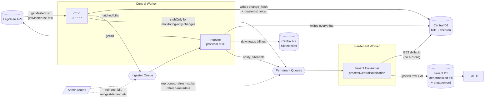

# Architecture

FloorVote uses a central-and-tenant design. One **central** Cloudflare Worker talks to LegiScan, stores every bill and its text, and fans changes out to per-tenant queues. Each **tenant** is a self-contained Worker with its own database, users, votes, and positions, and it never calls LegiScan directly. That way your legislative-API usage stays on a single account no matter how many tenants you run.

For the full, code-grounded pipeline — the cron passes, the ingestor, deduplication, and queue boundaries — see `docs/internal/sync-pipeline.md` in the repository.
