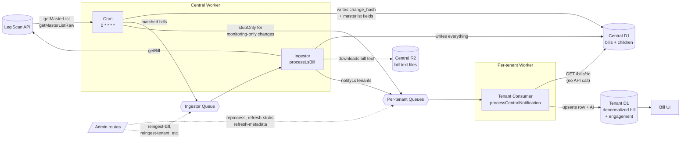

# Architecture

FloorVote uses a central-and-tenant design. One **central** Cloudflare Worker talks to LegiScan, stores every bill and its text, and fans changes out to per-tenant queues. Each **tenant** is a self-contained Worker with its own database, users, votes, and positions, and it never calls LegiScan directly. That way your legislative-API usage stays on a single account no matter how many tenants you run.

For the full, code-grounded pipeline — the cron passes, the ingestor, deduplication, and queue boundaries — see `docs/internal/sync-pipeline.md` in the repository.

## Why it's built this way

The central-and-tenant split isn't just a diagram — each piece answers a real constraint.

**One shared LegiScan account.** Legislative data providers meter access by account, so if every tenant called the API directly, a deployment with ten tenants would need ten subscriptions and would burn through query quota ten times as fast. Centralizing that one account means every tenant benefits from the same data without paying for it, or rate-limiting against it, individually.

**Full tenant isolation.** Each tenant is a separate Worker with its own database, users, votes, and positions. One organization's members, comments, and official positions never mix with another's, even though they're both fed by the same central pipeline. A tenant can be added, removed, or reconfigured without touching anyone else's deployment.

**Artificial intelligence runs tenant-side.** Summarization and relevance scoring happen inside each tenant, not centrally, because "relevant" means something different to every organization. Each tenant tunes its own keywords, context, and relevance question, so the same bill can be summarized and scored differently for two different teams.

**Bills are deduplicated before any real work happens.** The central service tracks whether a bill has actually changed before fanning it out, so tenants only do work — downloading text, running AI, notifying members — when there's something genuinely new to react to, not on every routine poll of the legislative API.
