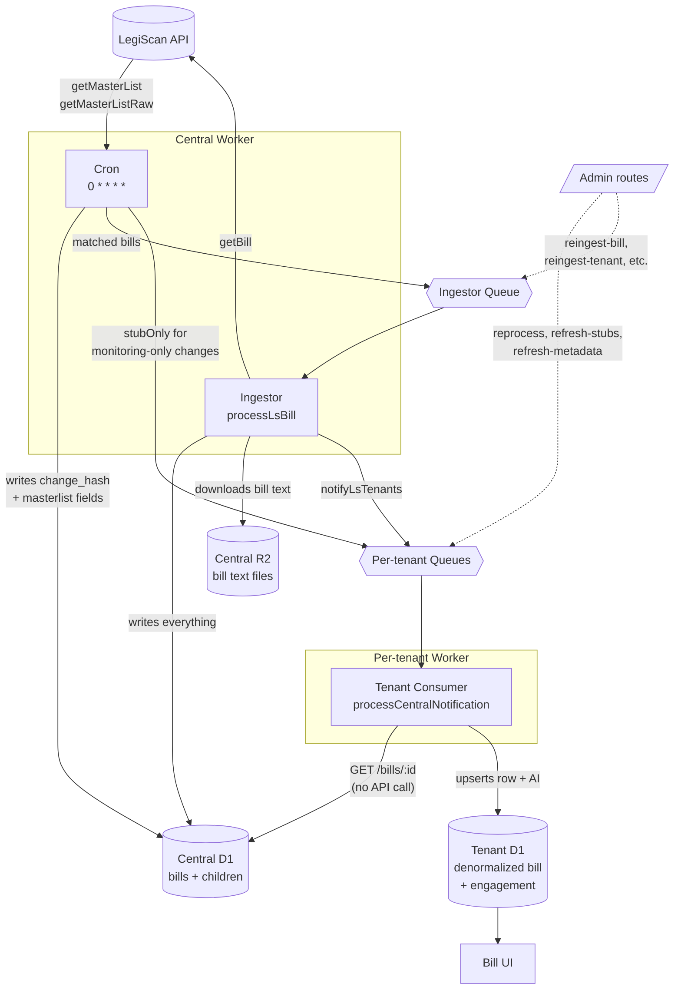

# Architecture

FloorVote uses a central-and-tenant design. One **central** Cloudflare Worker talks to LegiScan, stores every bill and its text, and fans changes out to per-tenant queues. Each **tenant** is a self-contained Worker with its own database, users, votes, and positions, and it never calls LegiScan directly. That way all legislative-API traffic comes from one place, on a schedule you control, however many tenants you run.

For the full, code-grounded pipeline — the cron passes, the ingestor, deduplication, and queue boundaries — see [`docs/internal/sync-pipeline.md`](https://github.com/floorvote/floorvote/blob/main/docs/internal/sync-pipeline.md) in the repository.

## Why it's built this way

The central-and-tenant split isn't just a diagram — each piece answers a real constraint.

**One cache, one caller.** Legislative APIs meter and rate-limit per account, and the same bill is usually of interest to more than one tenant. Central holds the provider account and the only copy of the bill text, so a bill is fetched once and read many times, and every request to the provider comes from a single hourly sync rather than from N tenants calling independently and racing each other's rate limits. Quota is then something you can see and plan for in one place — which is also why the seeding tools prefer the provider's bulk datasets over the API, and why there is no match-all keyword mode. Size your provider plan to the coverage and volume you actually need; see [How much does it cost?](/overview/how-much-does-it-cost#legiscan-free-for-most-paid-for-heavy-users).

**One provider interface.** Central reads legislative data through a provider interface (`central/src/providers/`), not a hardcoded vendor. LegiScan is the maintained implementation; an OpenStates provider sits alongside it, and adding another means writing one adapter against that interface rather than touching the pipeline. Everything downstream of central — storage, fan-out, tenants, AI — is provider-agnostic.

**Full tenant isolation.** Each tenant is a separate Worker with its own database, users, votes, and positions. One organization's members, comments, and official positions never mix with another's, even though they're both fed by the same central pipeline. A tenant can be added, removed, or reconfigured without touching anyone else's deployment.

**Artificial intelligence runs tenant-side.** Summarization and relevance scoring happen inside each tenant, not centrally, because "relevant" means something different to every organization. Each tenant tunes its own keywords, context, and relevance question, so the same bill can be summarized and scored differently for two different teams.

**Bills are deduplicated before any real work happens.** The central service tracks whether a bill has actually changed before fanning it out, so tenants only do work — downloading text, running AI, notifying members — when there's something genuinely new to react to, not on every routine poll of the legislative API.

## Interactive diagrams

Two standalone, explorable versions of the diagrams above, for when you want to trace a path rather than read prose:

- [**Architecture dossier**](/internal/architecture.html) — the full component map, expandable section by section.
- [**Sync flow**](/internal/sync-flow.html) — the LegiScan-to-tenant pipeline, step by step.

These are maintainer-oriented companions to [`docs/internal/sync-pipeline.md`](https://github.com/floorvote/floorvote/blob/main/docs/internal/sync-pipeline.md), which is the code-grounded source of truth.
