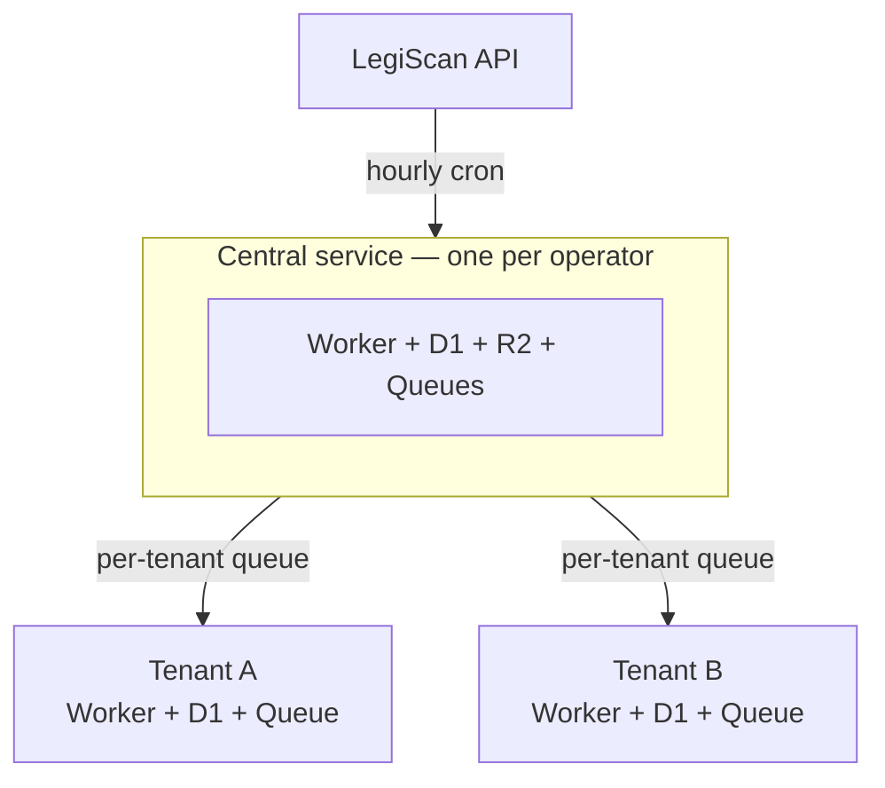

# Self-hosting: set up your central service

FloorVote runs on your own Cloudflare account. This page gets your **central service** running — the one shared worker that pulls in legislative data and feeds it to your teams. Once it's up, you [add one or more tenants](/self-hosting/tenants) (a tenant is one team's instance).

It's a guided, one-time setup, and every step is a terminal command you copy and run. You don't need to be a developer, but you should be comfortable running commands in a terminal.

## Accounts you'll need

Set up two accounts before you start:

- **Cloudflare** — where FloorVote runs. You'll need the [**Workers Paid**](https://www.cloudflare.com/plans/developer-platform/) plan ($5/month), which is required for Queues (how bill updates move from central out to your teams).
- **LegiScan** — where the bill data comes from. Register for a LegiScan account [here](https://legiscan.com/user/register), confirm it, then generate a free API key [here](https://legiscan.com/legiscan). The free tier — **30,000 API calls per month** — is enough for a national deployment.

> [!IMPORTANT]
> LegiScan provides the bill data through their API but is not involved with FloorVote. If you sign up for LegiScan, please don't contact them for help with FloorVote.

> [!NOTE]
> FloorVote also contains some code for interfacing with the [OpenStates API](https://v3.openstates.org/) as an alternative to LegiScan, but this code path is not actively maintained and lacks features present in the LegiScan path.

## Cloudflare API tokens

You'll use two kinds of Cloudflare API token. Knowing the difference up front makes the rest of this guide clearer:

- **One broad *deploy* token**, kept on your own machine. This is what `wrangler` (Cloudflare's command-line tool, used throughout this guide) uses to create resources and deploy workers. It lives in your shell as `CLOUDFLARE_API_TOKEN`.
- **A few narrow *runtime* tokens**, which the deployed worker itself uses for the handful of Cloudflare APIs it calls — for example, delivering bills to each team's queue. Each is stored as a worker secret, scoped to only what it needs. You create these at the steps that use them (the first is `CF_QUEUES_TOKEN`, below).

> [!WARNING]
> **Save each token as you create it.** Cloudflare shows a token's value only once. Paste each one into a password manager or a secure note the moment you create it — that's your record of your deploy token and each runtime token.

### Create the deploy token

1. In the Cloudflare dashboard, go to **My Profile → API Tokens → Create Token**.
2. Start from the **"Edit Cloudflare Workers"** template. It already covers almost everything — you only need to **Add** three more permissions. Each is a row with three fields (group, resource, access):
   - **Account** / **D1** / **Edit**
   - **Account** / **Queues** / **Edit**
   - **Zone** / **DNS** / **Edit** — lets you put teams on custom domains later
3. Create the token, copy it, and add it to your shell so `wrangler` uses it automatically:

```bash
# in ~/.zshrc or ~/.bashrc — API tokens don't expire
export CLOUDFLARE_API_TOKEN="..."
```

(Alternatively, `wrangler login` signs in through your browser, but that session expires periodically.)

## Prerequisites

- A Cloudflare account on the Workers Paid plan, with the deploy token above exported in your shell.
- **R2 storage enabled** on that account — a one-time step: in the dashboard, go to **R2 → Overview** and complete the subscription checkout. It has a free tier, but you can't create a bucket until it's activated.
- `wrangler` installed: `npm install -g wrangler`.
- The repository cloned, with dependencies installed (`npm install` from the repo root, and once inside `central/`).

## How it fits together



- **Central service** — one per operator. It makes all the legislative API calls and stores all the bill data, so you pay for one API key no matter how many teams you run. You set this up on this page.
- **Tenant workers** — one per team or topic. Each has its own users, votes, comments, and positions, and never calls LegiScan directly. You add these on the [next page](/self-hosting/tenants).

## Set up the central service

### 1. Provision Cloudflare resources

Run from the repository root:

```bash
wrangler d1 create central-bills
wrangler r2 bucket create central-bill-texts
wrangler queues create central-legiscan-ingestor
```

Save the `database_id` from the D1 output — you'll need it in the next step.

### 2. Configure `central/wrangler.toml`

Copy `central/wrangler.example.toml` to `central/wrangler.toml` and fill in your values. The key settings for a LegiScan deployment:

```toml
[env.legiscan]
name = "floorvote-central-legiscan"
main = "src/index-legiscan.ts"

[env.legiscan.vars]
# optional — shown as a credit in each team's footer
OPERATOR_NAME = "Your Organization Name"
BILL_PROVIDER = "legiscan"

[[env.legiscan.d1_databases]]
binding = "DB"
database_name = "central-bills"
database_id = "<YOUR_D1_DATABASE_ID>"
migrations_dir = "migrations-legiscan"

[[env.legiscan.r2_buckets]]
binding = "BILLS_BUCKET"
bucket_name = "central-bill-texts"

[[env.legiscan.queues.producers]]
binding = "INGESTOR_QUEUE"
queue = "central-legiscan-ingestor"

[[env.legiscan.queues.consumers]]
queue = "central-legiscan-ingestor"
max_batch_size = 5
max_batch_timeout = 30

[env.legiscan.triggers]
crons = ["0 * * * *"]
```

See `central/wrangler.example.toml` for the complete template, including optional bindings.

> [!TIP]
> To show your organization's logo in the app, add a file named exactly `web/public/operator-logo.svg` and rebuild. If it's absent, no logo renders (and a harmless `404` for `/operator-logo.svg` in the browser network log is expected).

### 3. Set central secrets

From inside `central/`:

```bash
wrangler secret put LEGISCAN_API_KEY --env legiscan

# A strong random string that guards admin endpoints
wrangler secret put ADMIN_SECRET --env legiscan
```

Generate a strong `ADMIN_SECRET` with:

```bash
openssl rand -base64 32
```

#### Queue delivery

Central delivers bills to each team's queue. For that it needs a Cloudflare API token scoped **Queues: Edit**, plus central's account ID:

```bash
wrangler secret put CF_QUEUES_TOKEN --env legiscan
```

Also set `CF_ACCOUNT_ID` in `[env.legiscan.vars]` (it's not a secret — get it from `wrangler whoami`). Without both, a team can register cleanly yet never receive a single bill, with no error. You can reuse your broad token from above, or create a narrow Queues: Edit token at **My Profile → API Tokens → Create Custom Token**.

> [!TIP]
> Central also offers an optional superadmin dashboard and observability panels. They're not needed to get running — see [Operating your deployment](/self-hosting/operating).

### 4. Run migrations and deploy

```bash
cd central
npm install
npm run deploy:legiscan
```

The deploy script runs migrations for you. The deployed URL will be `https://floorvote-central-legiscan.<your-subdomain>.workers.dev` — note it, you'll use it as `CENTRAL_API_URL` when adding tenants.

### 5. Verify

```bash
curl https://floorvote-central-legiscan.<your-subdomain>.workers.dev/api/health
# → {"status":"ok","operator":"Your Organization Name"}
```

Your central service is now running. From here it will sync live bill data on an hourly schedule.

## Optional: preload historical bills now

If you already know which sessions your teams will track — say, only New Jersey, or all 50 states plus Congress — you can load that historical bill data into central now, so it's ready the moment you add a tenant. This is optional: you can **skip it and bring bills in when you add a tenant** instead (the tenant guide walks through seeding a session).

Load LegiScan's bulk JSON datasets — this uses **zero API calls**. Download the zip files from [legiscan.com/gaits/datasets](https://legiscan.com/gaits/datasets) (one per state/session), extract them, then run the seeder for each session:

```bash
# LegiScan zips have a nested state/session/ directory inside. Unzip, then point
# --from-dir at the folder that contains the bill/ subdirectory:
unzip -q RI_2026-*.zip -d bulkseeds/RI_2026
find bulkseeds/RI_2026 -name "bill" -type d
# → bulkseeds/RI_2026/RI/2026-2026_Regular_Session/bill

npx tsx scripts/seed-legiscan.ts \
  --from-dir bulkseeds/RI_2026/RI/2026-2026_Regular_Session \
  --state RI \
  --session-id 2253 \
  --remote
```

This loads the bills into central only. Linking them to a team and running AI summaries happens when you [add the tenant](/self-hosting/tenants#step-8-seed-the-active-session-s).

> [!CAUTION]
> **Speed:** about 1,000 bills per minute against the remote database, so a typical state session (500–3,000 bills) takes 1–5 minutes. There's a `--from-api` option that downloads the dataset for you, but it can run out of memory on very large states (16,000+ bills) — use the manual download with `--from-dir` for those.

## Next steps

- **[Add your first tenant](/self-hosting/tenants)** — a team's instance, with its own users and keywords. This is the next required step.
- **[Operating your deployment](/self-hosting/operating)** — optional central features (superadmin dashboard, observability) and day-2 tasks (adding states, upgrading, monitoring).
- **[Turnstile](/self-hosting/turnstile)** and **[Public demo site](/self-hosting/demo)** — optional add-ons.

> [!IMPORTANT]
> **Using LegiScan data:** the free tier is 30,000 API calls per month. Bill data is licensed CC BY 4.0, so any UI that displays it must include "Data provided by LegiScan" attribution (FloorVote does this by default). Deeper LegiScan operational notes are in [`docs/internal/legiscan-notes.md`](https://github.com/floorvote/floorvote/blob/main/docs/internal/legiscan-notes.md) in the repository.
